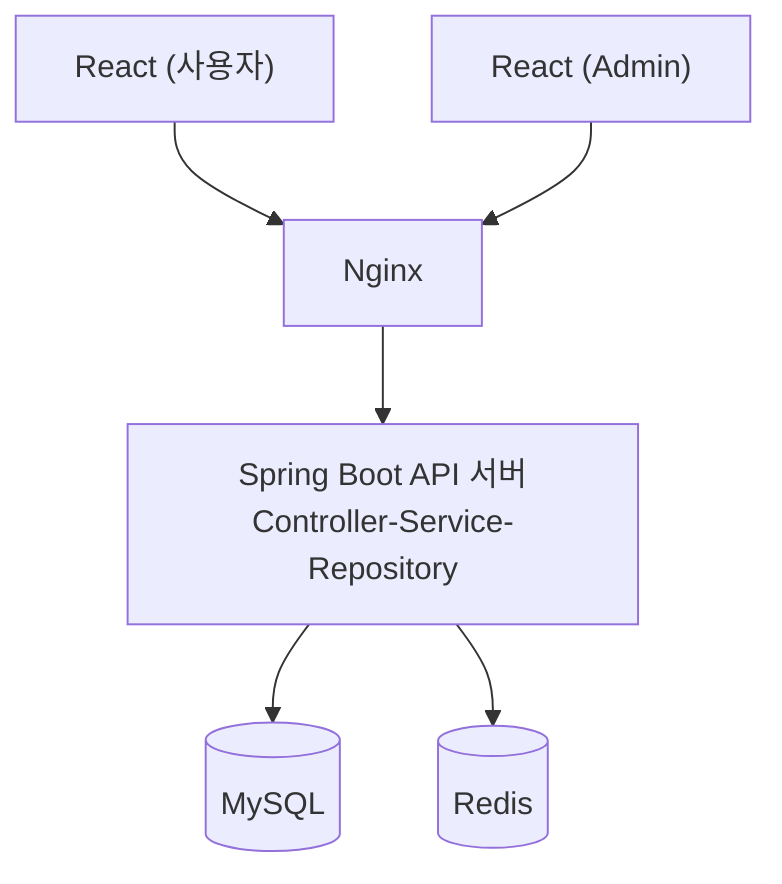
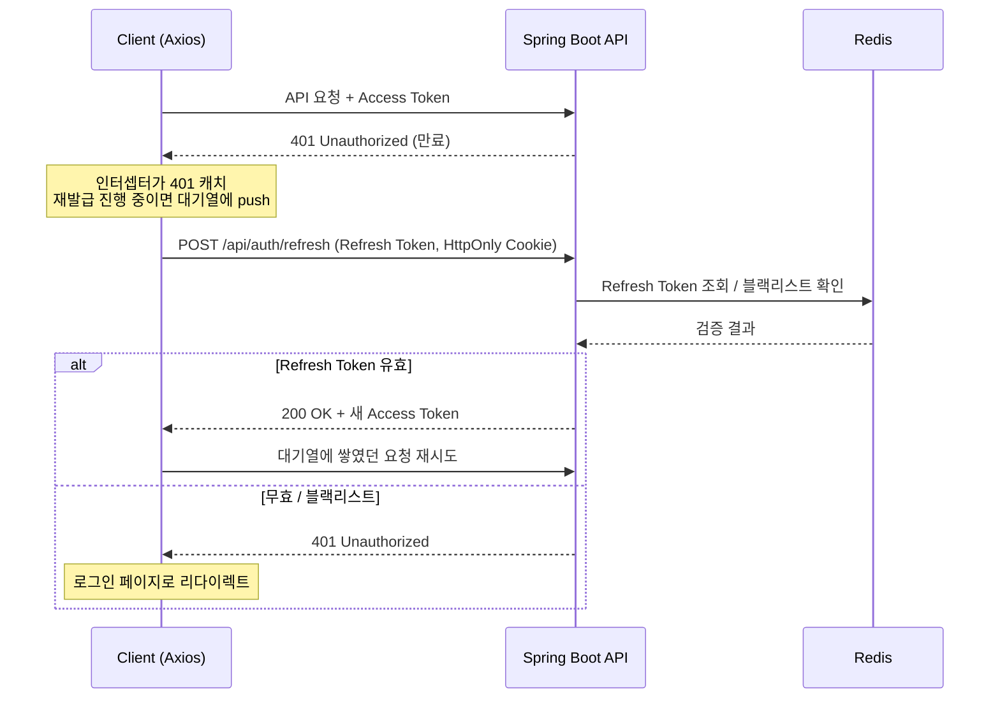
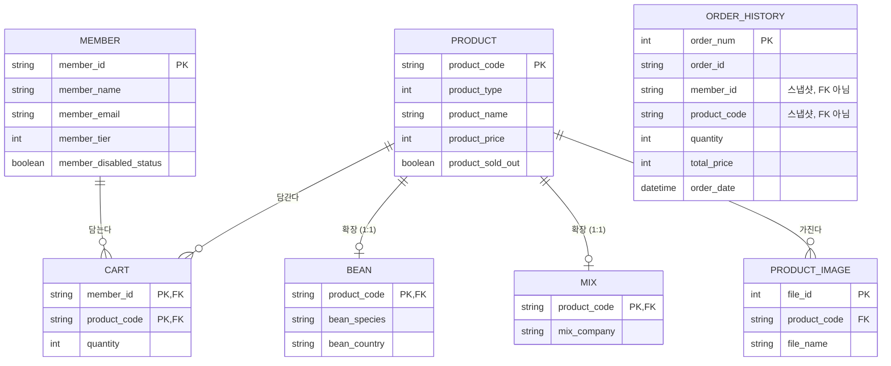

# 다올커피 (DaCoffee)

커피 원두, 머신, 카페용품을 파는 이커머스 사이트와 이걸 관리하는 별도 Admin 시스템으로 이루어진 개인 프로젝트입니다.

- Backend: https://github.com/woohojin/Coffee (이 저장소)
- 사용자 화면 / 관리자 화면: `frontend`, `frontend-admin` 디렉터리 (별도 React 앱)

## 핵심 기능

- 회원가입/로그인, JWT 기반 인증 (Access Token + Refresh Token + Redis 블랙리스트)
- 상품(원두/머신/카페용품) 조회, 장바구니, 주문
- 주문 내역은 스냅샷 방식으로 저장해서 상품이 삭제돼도 이력이 남음
- 관리자 전용 회원/상품/주문 관리 시스템 (별도 React 앱으로 분리, 엑셀 다운로드 지원)

## 기술 스택

| 구분 | 사용 기술 |
| --- | --- |
| Backend | Java 17, Spring Boot 3.2.4, Spring Security, Spring Data JPA (Hibernate) |
| Database | MySQL 8, Redis |
| Auth | JWT (jjwt), Access + Refresh Token |
| Frontend | React 19 (Vite), Axios, React Router |
| Infra | Docker / Docker Compose, Nginx (`frontend`, `frontend-admin` 정적 서빙) |
| 기타 | Apache POI (엑셀 다운로드), Spring Mail |

## 아키텍처



`docker-compose.yml` 기준으로 `backend`(Spring Boot), `frontend`/`frontend-admin`(React, Nginx로 정적 서빙), `mysql`, `redis` 컨테이너로 구성됩니다.

### 인증 흐름 (Access + Refresh + Redis)

Access Token이 만료되면 axios 인터셉터가 401을 캐치해서 `/api/auth/refresh`를 호출하고, Refresh Token을 Redis에 저장된 값과 대조해 유효성/블랙리스트 여부를 확인합니다. 여러 화면에서 동시에 401이 떠도 재발급 요청은 하나만 나가도록 대기열을 뒀습니다.



## 데이터베이스 설계

`order_history`는 의도적으로 `member`/`product`를 FK로 참조하지 않습니다. 상품이 삭제되거나 가격이 바뀌어도 과거 주문 기록은 주문 시점 그대로 남아있어야 한다고 판단해서, FK 대신 주문 시점의 값을 스냅샷으로 복사해 저장합니다.



`member_withdrawal`은 탈퇴 시 `member`에서 이관되는 아카이브 테이블로, 마찬가지로 FK 관계 없이 독립적으로 존재합니다.

## API

| Controller | Base Path | 설명 |
| --- | --- | --- |
| `AuthApiController` | `/api/auth` | Access Token 재발급 (`POST /refresh`) |
| `MemberApiController` | `/api/member` | 회원가입/로그인 상태 확인/프로필/장바구니/결제/비밀번호 찾기 |
| `ProductApiController` | `/api/products` | 상품 목록/상세/검색 (승인된 회원 전용 — 등급별 도매가가 노출되기 때문에 비로그인/미승인 회원은 차단) |
| `AdminApiController` | `/api/admin` | 회원/상품/주문 관리, 엑셀 다운로드 (관리자 전용) |

### 결제 처리

결제 페이지에 진입하는 시점에 클라이언트가 보낸 금액을 그대로 믿지 않고, 서버가 장바구니 데이터를 기준으로 직접 금액을 계산해서 Redis에 임시로 저장해둡니다. 실제 결제가 완료된 시점에 PG사(토스)에서 돌아온 금액과 이 값을 대조해서, 일치하지 않으면 결제 자체를 거부합니다. 클라이언트가 중간에 개발자 도구로 요청을 조작하더라도 서버 쪽에서 걸러지도록 만든 구조입니다.

### Admin을 별도 React 앱으로 뗀 이유

일반 사용자 화면과 관리자 화면을 같은 프로젝트 안에 두면 권한 관리나 배포가 계속 꼬일 것 같아서, 처음부터 별도 프로젝트(`frontend-admin`)로 분리했습니다.

## 로컬 실행

```bash
# 1. 환경 변수 설정
cp .env.example .env
# .env를 열어 MYSQL_ROOT_PASSWORD, MYSQL_USER, MYSQL_PASSWORD 채우기

# 2. Docker Compose로 전체 스택 기동 (MySQL, Redis, Backend, Frontend, Admin)
docker compose up -d --build
```

| 서비스 | 포트 |
| --- | --- |
| Backend (Spring Boot) | `8080` |
| Frontend (사용자) | `5173` |
| Frontend-Admin | `5174` |
